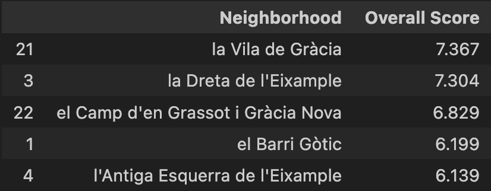

# project_3

## Introduction

The objective of this project is to provide a short-list of possible new office locations for a gaming company that wants to establish itself in Barcelona. The goal is to find the best possible locations based on the following parameters: availability of entertainment, availability of schools, proximity to other design companies and proximity to other tech companies. 
 

## Data sources

We will be working with a GeoJSON file with information about neighbourhoods in Barcelona, called "barris.geojson". 

We will also be working with the FourSquare places API in order to retrieve information about venues, schools and other relevant parameters for every neighbourhood in Barcelona. 
 

## Methodology

Libraries: 

The following libraries have been used: 
    - requests: in order to make requests to the FourSquare API
    - pandas and geopandas: for dataframes and general data handling
    - json: in order to handle json and geojson files
    - pymongo: to establish connection with, create and make requests to mongodb collections
    - shapely: to handle polygons their coordinates
    - folium: for maps and visualization

Workflow: 

    1. Create MongoDB collection with Barcelona neighbourhoods GeoJSON
    2. Find centroids of each neighbourhood
    3. Make FourSquare requests for nearby points of interest (schools, bars, design companies and tech companies) for every neighbourhood
    4. Count and assign instances of points of interest within every neighbourhood. 
    5. Assign score for every neighbourhood based on availability of points of interest
    6. Assess the top performing neighbourhoods overall based on weighted average
    7. Visualization through folium
 

## Results

The following map shows all the neighbourhoods in Barcelona based on the availability of points of interest. 

We can observe that the darker areas (the ones with most availability) are located in the central areas of Barcelona. The assumption is that with more availability, employees will have a wider range of options and therefore the ability to make the best possible choices. The top 5 best performing neighbourhoods are the following:

The following map shows the centroid of the top 5 best performing neighbourhoods.  

 

## Conclusion

The neighbourhood that adapts more to the requirements is Vila de Gràcia. This is a centric neighbourhood that has the highest availability of points of interest within walking distance. Of course, the assumption can be challenged that just the density of points is the most relevant metric. 

